# Tu Tuning
 
TU Tuning is a website for advertising services for cars such as, car remaps and general servicing.   
 
 

# Motivation
 
My motivation for this project was my little brother. He is starting his own business and needed a website for customers to contact him and to advertise his services.  
 
    

# Table of contents
1. [Project Description](#project-description)
    1. [UX Design](#ux-design)
    2. [Navigation](#navigation)
    3. [Landing Page](#landing-page)
    4. [About us](#about-us)
    5. [Contact](#contact)
    6. [Footer](#footer)
    7. [Responsive Design](#responsive-design)
2. [Technologies Used](#technologies-used)
3. [Facebook Page](#facebook-page)
4. [Instagram Page](#instagram-page)
5. [Development](#development)
6. [Deployment](#deployment)
7. [Tests](#tests)
8. [Validators](#validators)
9. [Bugs & Solutions](#bugs-&-solutions)
10. [Updates](#updates)
11. [Credits](#credits)

## Project Description 

  - UX Design 
   
   
  The website was designed to be simple and easy to read to advertise the services on offer. The colours chosen were white, black and red to fit with the logo and make the contrast easy on the eyes. Each nav link is clearly displayed and accurately named which makes the site easy to use. 
   
  

  - Navigation 
   
   
  The website is navigated using a single navbar with four links, a home link, about us link, contact link and the logo which also acts as a link to the home page.
   
   
  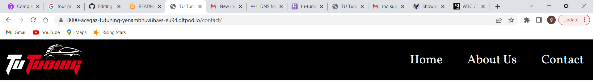
  

  - Landing Page 
   
   
  The landing page contains a welcome message with an image of a car after a service and a "what we offer" section, this section shows the user what services are available to them.
   
   
  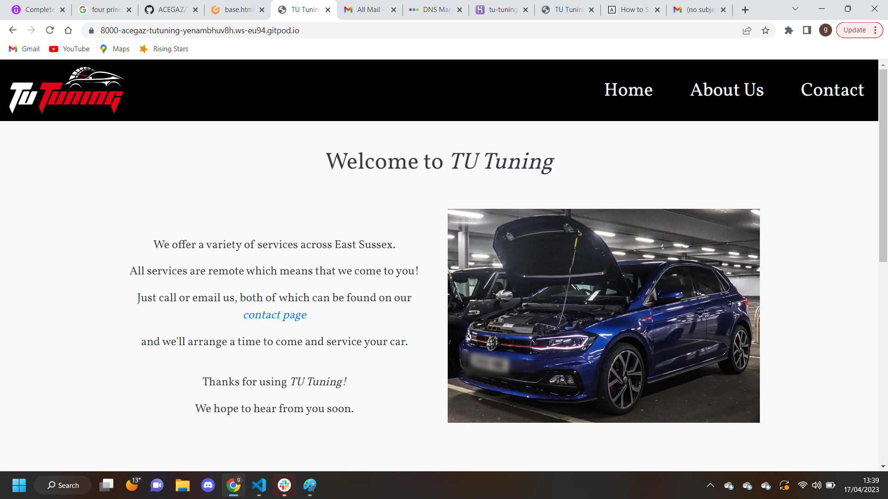
   
   
  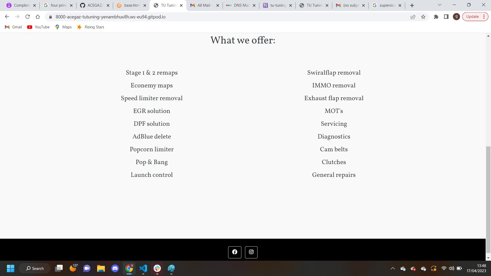
  

  - About us 
   
   
  The about us page explains about the business and the owner showing users that it is a local, family run business.
   
    
  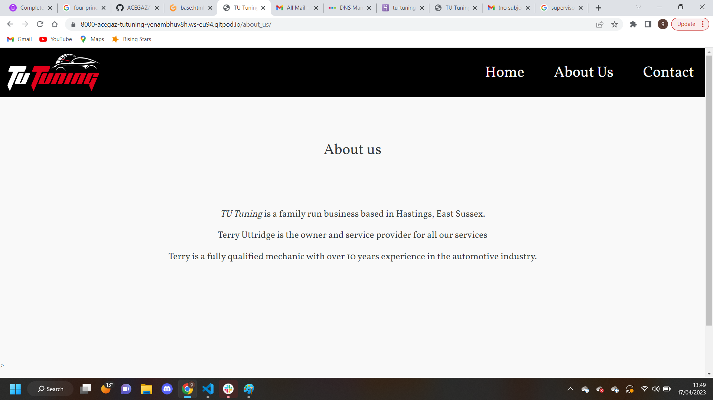
  

  - Contact 
   
   
  The contact page allows users to complete an inquiry form with thier contact details, which is sent to the business owners email account. 
   
   
  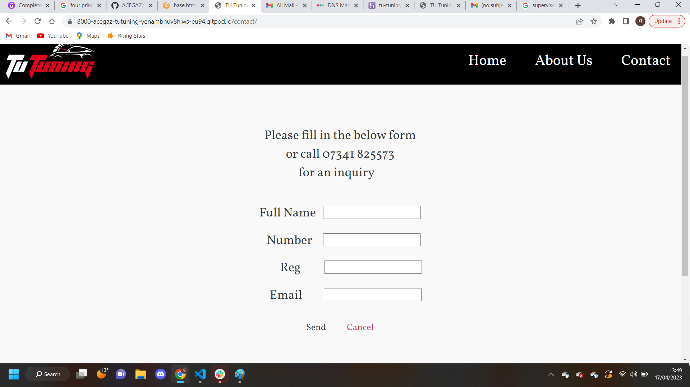
  

  - Footer 
   
   
  The footer contains the links for the facebook and instagram business pages. Both links are opened in a new window. 
   
    
  
  

  - Responsive Design 
   
   
  On mobile and tablets the nav bar becomes a burger icon. On mobile screens only the home pages 2 columns become a single column.
  The other two pages remain the same as the content already fits on all views. 
   
   
  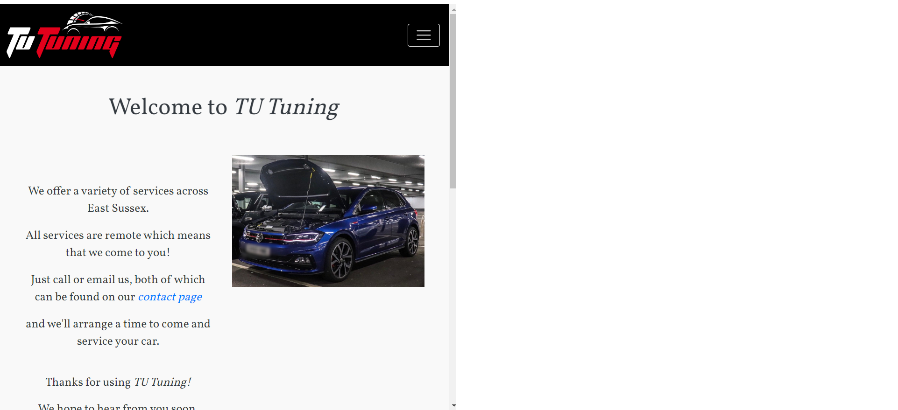
   
   
  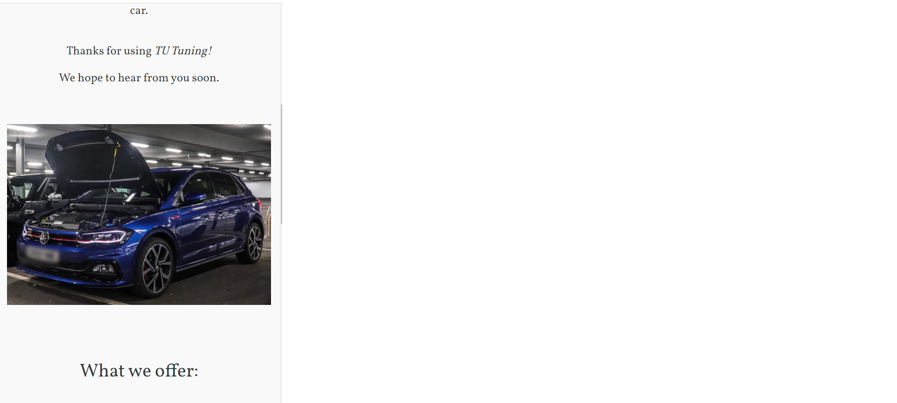
   
   
  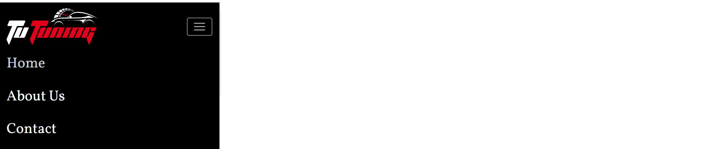
  

## Technologies Used 
 
 
  For this project the main technologies used were Python, Django, Bootstraps. 
  Python was used as it is required for Django and Django was used to save time when creating forms. 

  Bootstraps was used to enable easy editing of html and css elements so the wesite could be developed faster. 
  
  Along with the above technologies many python modules were installed, the full list can be seen below:

  - asgiref==3.6.0
  - backports.zoneinfo==0.2.1
  - dj-database-url==1.2.0
  - Django==4.1.7
  - gunicorn==20.1.0
  - sqlparse==0.4.3
  - whitenoise==6.4.0
  

## Facebook Page 
 
 
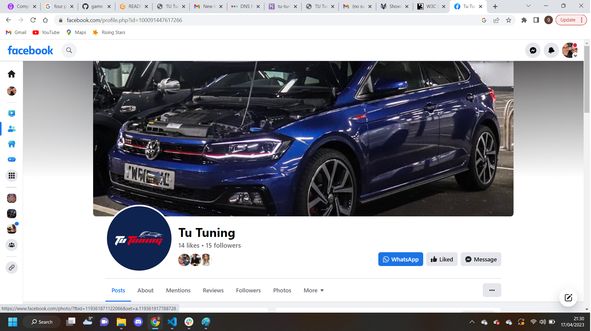

## Instagram Page 
 
 
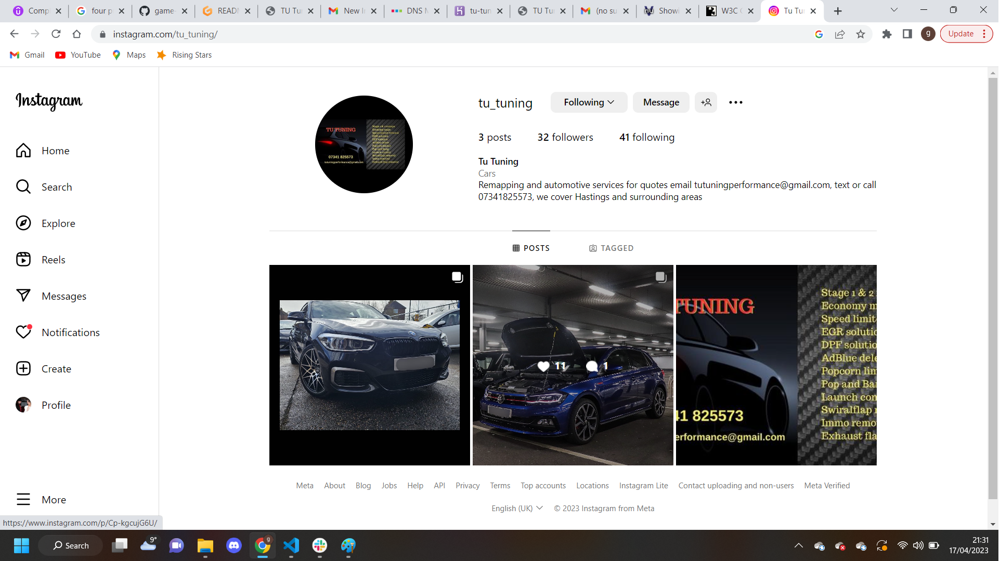

## Development 
 
 
Tu Tuning was designed with a free style approach. The website was a very simple design so I decided not to use agile methodology and instead work 1 on 1 with my brother (the owner) to develop the site. 

## Deployment 
The Tu Tuning website was deployed on Heroku using the following steps:

1. I prepared Procfile
2. I created the Tu Tuning app on Heroku
3. I installed dj_database_url in my project
4. I used pip freeze > requirements.txt to place all installed packages in the requirements.txt folder
5. I imported dj_database_url to settings.py
6. I configured the database in settings.py to use the dj_database
7. I made migrations using python3 manage.py makemigrations and python3 manage.py migrate
8. I added DISABLE_COLLECTSTATIC, EMAIL_HOST_PASSWORD, EMAIL_HOST_USER and SECRET_KEY to Heroku config vars
9. I configured my settings.py to include all keys from env.py
10. On the Heroku website I then navigated to the deployment tab and connect my Github repository to Heroku
11. I allowed automatic commits so that Heroku would always have the current version of my app
12. Then I successfully deployed my app using the deploy branch button.

## Tests 
- Functional testing 
   
   
  link tests
   
   

  Description: 

  Check all links work.

  Steps:

  1. Navigate to [Tu-Tuning](https://tu-tuning.herokuapp.com/) and click on all links.
  2. Be taken to the appropriate page.
   
   
  Expected:
   
   
  The user is taken to the correct page
   
   
  Actual: 
   
   
  The user is taken to the correct page
   
   
   

  Contact form test
   
   
  
  Description: 

  Check the contact form is sent correctly.

  Steps:

  1. Navigate to [Tu-Tuning](https://tu-tuning.herokuapp.com/) and click on contact link.
  2. Complete the contact form.
  3. Click send
   
   
  Expected:
   
   
  The user is given the inquiry sent message and the information is sent.
   
   
  Actual: 
   
   
  The user is given the inquiry sent message and the information is sent.
   
   

  Description: 

  Check the contact form is received correctly.

  Steps:

  1. Navigate to [Tu-Tuning](https://tu-tuning.herokuapp.com/) and click on contact link.
  2. Complete the contact form.
  3. Click send
  4. Check that the email was received on the email account that is set up. 
   
   
  Expected:
   
   
  The users information is received
   
   
  Actual: 
   
   
  The users information is received
   
   
  

## Validators 

I used W3C and lighthouse to validate my code and gitpods in-built python validator to check my pyhton code.
 
All results can be seen below.
 
 
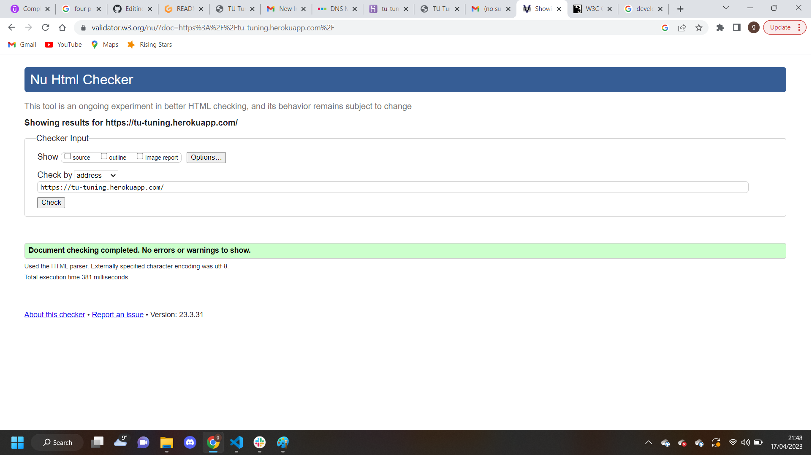
 
 
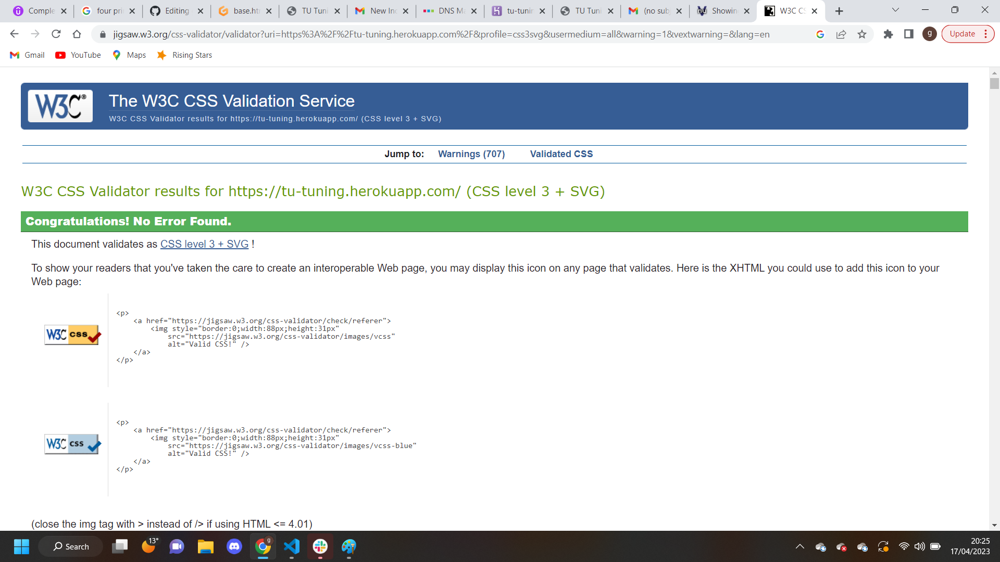
 
 
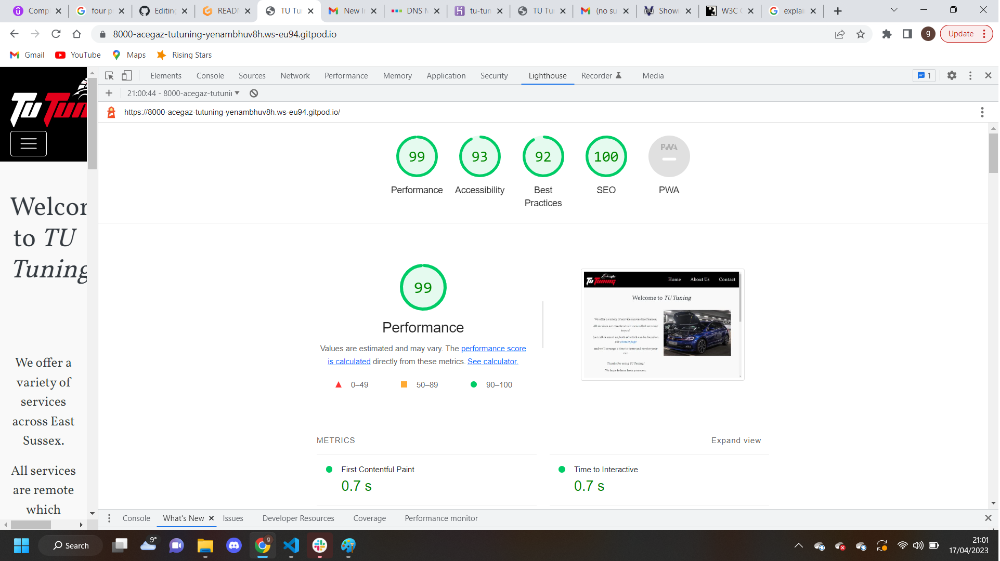

## Bugs & Solutions 
 
 
There were no major bugs to speak when creating this website.

 

## Updates 
 
 
In the future I would like to add the fuctionality for users to see the power increase in their car when getting a remap using a app built into the website.

## Credits 
 
 
All images used are the property of Terry Uttridge.

